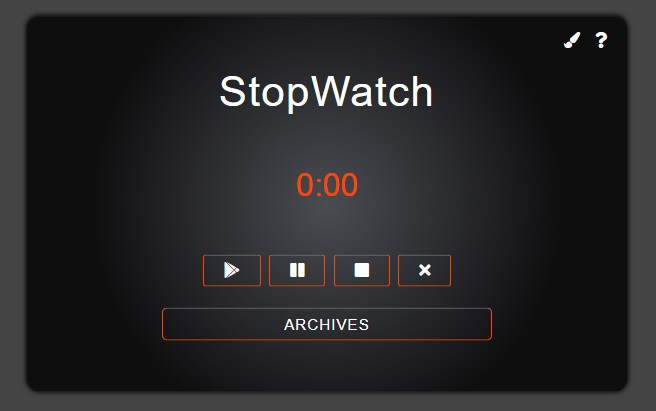

# StopWatchApp

## Demo

[**click live demo of the project**](https://dominiksiejka.github.io/BillSplitterApp)



## Table of Contents

- [About the Project](#description)
- [How to use](#how-to-use)
- [Technologies used](#built-with)
- [Setup steps](#setup)
- [Sources](#sources)
- [License](#license)

## Description

StopWatch app measures the time in seconds. It can be useful to see how many seconds does it take to do something, some exercises for example. It contains play, pouse, reset, clear archives button and archives section.You can also change the border colors and show the instruction by pressing on question mark.

## How to use

In order for the time to start running press the play button. To stop the the for a second and then continue press the pouse button. To reset the timer to default value press the reset button. By clicking the reset button you also make a note of the last time in the archive section. To see the last results click the archive button and the records will be displayed. To clear the archives section simply just press the clear button which is the last button after the reset button. To change the colors og the app click the brush on the top right corner and pick one of three different colors. To show the instructions press the question mark button which is placed next to color brash.

## Built with

- HTML5
- CSS/SASS
- Vanilla JavaScript

## Setup

```
with BASH

# clone the remote repo to your local one
$ git clone https://github.com/dominiksiejka/BillSplitterApp.git

# open the index.html file or use your code editor to open it with live server

```

## Sources

- Icons from [Font Awesome ](https://fontawesome.com)
- Font from [Google Fonts ](https://fonts.google.com/)

## License

- MIT © [Dominik Siejka ](https://github.com/dominiksiejka/BillSplitterApp)
